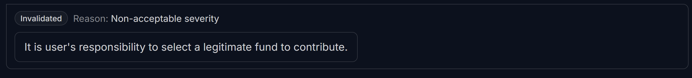
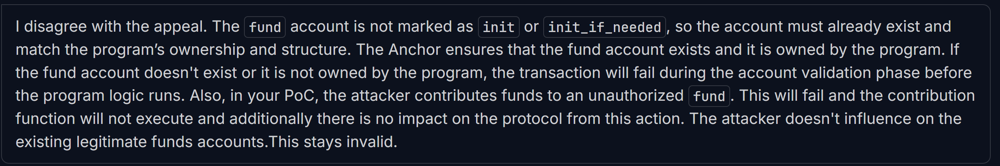

## <a id='H-01'></a>H-01. Improper Ownership and PDA Validation Enables Unauthorized Fund Redirection            


## Summary

The `FundContribute` struct lacks necessary ownership and PDA validation, allowing attackers to substitute arbitrary accounts. Since Solana’s Anchor framework relies on account constraints to enforce security, missing constraints create a critical vulnerability, enabling fund redirection.

## Vulnerability Details

1. **Ownership Check Missing:** 

   * The `fund` account does not enforce that it is owned by the program (`has_one = creator`), which allows an attacker to substitute any arbitrary account in place of the intended `fund`.
   * This opens the door for **unauthorized access** and **account substitution attacks** , where an attacker could redirect contributions to a malicious fund.
2. **PDA Validation Missing:**

   * The `fund` account does not validate its derivation as a PDA using the appropriate seeds (e.g., `[b"fund", fund.creator.as_ref()]`).
   * Without PDA validation, an attacker could pass an arbitrary account that satisfies the `Account<'info, Fund>` type but is not the correct PDA-derived `fund`.

&#x20;

## Impact

1. **Unauthorized Fund Manipulation:**\
   Attackers can pass arbitrary accounts for `fund`, bypassing crowdfunding-specific rules.
2. **Account Takeover:**\
   Attackers can manipulate contributions of other users by passing incorrect `contribution` accounts.
3. **Trust & Security Violation:**\
   Contributors may lose funds due to malicious manipulation of accounts, undermining the platform’s guarantees of transparency and security.

## Proof of Concept

The following PoC demonstrates how an attacker can substitute an unauthorized `fund` PDA and redirect contributions. By using `Pubkey::find_program_address` with an arbitrary seed, the attacker generates a fake PDA and bypasses validation.

```Rust

// Attacker generates a fake fund PDA instead of the expected one
let fake_fund_pda = Pubkey::find_program_address(&[b"fake_seed"], ctx.program_id);

// Attacker submits a contribution but routes funds to a fake campaign
let tx = program.methods
    .contribute(amount)
    .accounts({
        fund: fake_fund_pda, // Bypasses the expected fund validation
        contributor: attacker.key(),
        contribution: attacker_contribution_account, // Fake contribution record
        system_program: system_program::ID,
    })
    .signers([attacker])
    .rpc();
```

## Recommendations

Option One: Anchor Constraints

Update the `FundContribute` struct as follows:

```Rust
#[derive(Accounts)]
pub struct FundContribute<'info> {
    #[account(
        mut,
        seeds = [b"fund", fund.creator.as_ref()],
        bump,
        has_one = creator // Ensure fund is owned by the creator
    )]
    pub fund: Account<'info, Fund>,
    
    #[account(mut)]
    pub contributor: Signer<'info>,
    
    #[account(
        init_if_needed,
        payer = contributor,
        space = 8 + Contribution::INIT_SPACE,
        seeds = [fund.key().as_ref(), contributor.key().as_ref()],
        bump,
        has_one = contributor, // Ensure contributor owns this record
        has_one = fund // Ensure contribution is linked to the correct fund
    )]
    pub contribution: Account<'info, Contribution>,
    
    pub system_program: Program<'info, System>,
}
```

Option Two: Explicit Checks in Function Body:

```Rust
pub fn contribute(ctx: Context<FundContribute>, amount: u64) -> Result<()> {
    let fund = &ctx.accounts.fund;
    let contribution = &ctx.accounts.contribution;
    let contributor = &ctx.accounts.contributor;

    // Validate fund PDA
    let (expected_fund_pda, _) = Pubkey::find_program_address(
        &[b"fund", fund.creator.as_ref()],
        ctx.program_id,
    );
    if fund.key() != expected_fund_pda {
        return Err(ErrorCode::UnauthorizedAccess.into());
    }

    // Validate contribution ownership
    if contribution.contributor != contributor.key() {
        return Err(ErrorCode::UnauthorizedAccess.into());
    }

    // Rest of the function logic...
}
```

## Judge Decision 
<span style="color:red; font-weight:bold;">(Invalidated. Reason: Non-acceptable severity)</span>



## Appeal Submitted

The judge dismissed the finding, claiming "it is the user’s responsibility to select a legitimate fund to contribute." However, this reasoning overlooks the core issue of **smart contract security**. The vulnerability represents a **serious security breach** that directly impacts the integrity of the protocol and exposes user funds to theft. This issue should be **classified as high severity** due to its **direct impact on funds**, **high likelihood of exploitation**, and **failure of the contract to enforce basic security checks**.

&#x20;

### 1. Impact on Security and User Funds:

The **lack of ownership validation** and **PDA checks** creates a **critical vulnerability** that directly compromises user **funds**. By failing to validate that the `fund` account is owned by the program and correctly derived as a **Program Derived Address (PDA)**, the contract allows **attackers to redirect contributions** to arbitrary, malicious accounts. This is not about "user responsibility"—it is a **failure of the protocol to enforce security**. The protocol should ensure these rules are followed automatically, not place that burden on the user, thus resulting in **unauthorized fund manipulation** and **undermining trust**.

### 2. The Role of the Smart Contract in Ensuring Trust:

Smart contracts are designed to **enforce rules automatically** and securely. Expecting users to manually select legitimate accounts or be responsible for **security breaches** that arise from improper contract logic is unreasonable. By failing to validate critical elements like ownership and PDA derivation, the contract **exposes users to risks** they cannot mitigate. Allowing arbitrary accounts to substitute valid PDAs completely **undermines the protocol’s trust** and **security guarantees**.

### 3. Likelihood of Exploitation:

The judge suggested that the vulnerability is "user-dependent" and thus less likely to be exploited. However, the **vulnerability is trivially exploitable**—no preconditions are required, and the attacker only needs to substitute a malicious PDA. This is a **basic substitution** attack, exposing users to direct financial loss. This kind of exploitation is **not something a regular user can easily detect** or prevent. It requires **technical knowledge of Solana's Anchor framework**, specifically the PDA mechanism, which the **average user** does not possess. Without safeguards in place, this vulnerability is a **clear attack vector**.

### 4. The Judge's Dismissal Misses the Protocol's Responsibility:

The judge's dismissal fails to recognize the **protocol's responsibility** to **secure user funds**. It is not the user's fault for selecting a bad fund; the protocol must **automatically enforce security**. By failing to validate ownership and PDA, the contract **introduces significant risk** and compromises functionality, allowing malicious actors to exploit the system.

### 5. Why This Should Be High Severity:

Based on **Cyfrin Updraft Severity Guidelines**, this vulnerability should be **high severity** because:

* **Direct impact on funds**: Attackers can redirect funds to malicious accounts, leading to **loss or theft** of funds.
* **High likelihood of exploitation**: The vulnerability is **trivial to exploit**, requiring no special conditions or sophisticated methods.
* **Protocol disruption**: The vulnerability undermines the protocol's **core functionality**, compromising trust and security.
* **Failure to safeguard contributors**: The absence of ownership and PDA validation means contributors are at risk, and the contract does not **automatically safeguard their funds**.
* **Technical complexity**: Exploiting this vulnerability requires **technical knowledge** of Solana’s Anchor framework, making it more difficult for regular users to detect or prevent, which increases the overall risk.

### Conclusion:

The failure to validate account ownership and PDAs is a **critical vulnerability** that **directly threatens user funds**. The protocol’s core responsibility is to prevent unauthorized fund manipulation, which it fails to do in this case. The exploit is **highly exploitable**, requires no barriers to entry, and compromises the **trust** and **security** of the protocol. Since it is not something a regular user can detect or prevent, and it demands **technical expertise**, this should be classified as a **high severity** issue, representing a **severe breach** of security that compromises the safety of both users and the protocol.


## Judge Decision on Appeal: 
<span style="color:red; font-weight:bold;">(Invalidated. Reason: Non-acceptable severity)</span>


