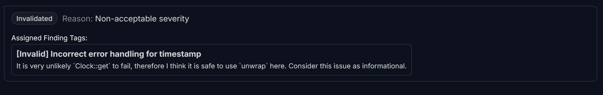

## <a id='H-02'></a>H-02. Unsafe Timestamp Handling            


## Summary

The `contribute` function suffers from three major vulnerabilities:

1. \*\*Timestamp Handling is Unsafe: \*\*

   * `Clock::get().unwrap().unix_timestamp.try_into().unwrap()` can panic, freezing the contract.
   * This affects both fund withdrawals and refund processing.
2. **Deadline is Optional (Zero):**

   * If `deadline == 0`, contributors can never get refunds, and creators can’t withdraw.
   * If the goal is met, but the deadline is missing, funds can never be withdrawn.
3. **Timestamp Failure Can Cause Refund/Withdraw Failures:**

   * If `Clock::get()` fails, refunds and withdrawals break simultaneously.
   * Even if the campaign met its goal, funds can remain frozen due to a broken timestamp.

## Vulnerability Details

### `Clock::get()` can Panic and Halt Crowdfunding: 

The function currently unwraps the timestamp unsafely which can cause a panic if:

* `Clock::get()` fails to fetch the blockchain timestamp.
* `unix_timestamp.try_into()` fails due to an overflow, especially in edge cases when handling large timestamps.

```Rust
Clock::get().unwrap().unix_timestamp.try_into().unwrap()
```

### `deadline == 0` Means No End Condition:

The contract only checks if `fund.deadline` is reached and doesn't check if `deadline == 0`:

* If goal is met, creator can’t withdraw.
* If goal isn’t met, contributors can’t get refunds.
* This means the funds will be permanently stuck.

```Rust
if fund.deadline != 0 && fund.deadline < Clock::get().unwrap().unix_timestamp.try_into().unwrap() {
    return Err(ErrorCode::DeadlineReached.into());
}
```

## Impact

1. Complete Crowdfunding Failure:
   * No transactions work if `Clock::get()` fails.
   * Contributors can’t get refunds if goal isn't met.
   * Creators can’t withdraw even if goal is met.
2. Permanent Fund Locking:
   * If deadline == 0, neither refunds nor withdrawals work.
   * Contributors can't retrieve their deposits, creators can’t use funds.
   * Worst-case scenario: contract becomes unusable forever.
3. Trust Violation & Security Exploit:
   * Malicious campaigns can intentionally set `deadline == 0` to lock funds forever.
   * Users will lose confidence in the platform if funds become unrecoverable.

## Proof of Concept

Anchor Tests:  To simulate and catch unwrap failures under various conditions.

The transaction should **fail safely** with a `"Calculation overflow"` error, preventing unexpected panics.

```TypeScript
it("Fails safely when timestamp retrieval is invalid", async () => {
 // Mock an invalid timestamp scenario by intercepting Clock account fetch
 const fakeClock = {
     unixTimestamp: new anchor.BN("-9223372036854775808"), // Extreme negative value
 };

 // Inject the fake clock into the test environment
 const mockClock = await program.account.clock.create(fakeClock);

 try {
     await program.methods
         .contribute(new anchor.BN(100)) // Valid contribution
         .accounts({
             fund: fundPDA,
             contributor: contributor.publicKey,
             contribution: contributionPDA,
             systemProgram: anchor.web3.SystemProgram.programId,
             clock: mockClock.publicKey, // Using our fake timestamp
         })
         .signers([contributor])
         .rpc();
 } catch (err) {
     console.log("Transaction failed as expected:", err.message);
     expect(err.message).toContain("Calculation overflow"); // Expected error
 }
});
```

## Recommendations

* Safe Timestamp Retrieval with Error Handling
* Explicitly rejecting contributions if deadline isn't set

```Rust
pub fn contribute(ctx: Context<FundContribute>, amount: u64) -> Result<()> {
    let fund = &mut ctx.accounts.fund;
    let contribution = &mut ctx.accounts.contribution;
    
    // Ensure the campaign has a valid deadline before accepting contributions
    if fund.deadline == 0 {
        return Err(ErrorCode::InvalidDeadline.into());
    }

    // Safely get the current blockchain timestamp and handle conversion errors
    let current_time = Clock::get()
        .map_err(|_| ErrorCode::CalculationOverflow)? // Handle potential failure
        .unix_timestamp
        .try_into()
        .map_err(|_| ErrorCode::CalculationOverflow)?; // Handle conversion failure

    // Enforce deadline properly, ensuring past contributions are not allowed
    if fund.deadline != 0 && fund.deadline < current_time {
        return Err(ErrorCode::DeadlineReached.into());
    }

    // Rest of function logic...
}
```

## Judge Decision 
<span style="color:red; font-weight:bold;">(Invalidated. Reason: Non-acceptable severity)</span>


