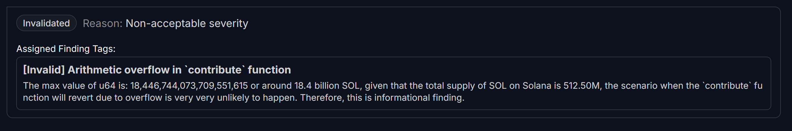

## <a id='H-06'></a>H-06. Integer Overflow in Fund Contribution and Amount Tracking            


## Summary

`contribute` function **lacks integer overflow protection** when updating `fund.amount_raised`. This can allow an attacker to **manipulate contributions** and cause unexpected fund behavior.

## Vulnerability Details

```Rust
pub fn contribute(ctx: Context<FundContribute>, amount: u64) -> Result<()> {
        let fund = &mut ctx.accounts.fund;
        let contribution = &mut ctx.accounts.contribution;
        
        if fund.deadline != 0 && fund.deadline < Clock::get().unwrap().unix_timestamp.try_into().unwrap() {
            return Err(ErrorCode::DeadlineReached.into());
        }
    
        // Initialize or update contribution record
        if contribution.contributor == Pubkey::default() {
            contribution.contributor = ctx.accounts.contributor.key();
            contribution.fund = fund.key();
            contribution.amount = 0; // Initialized but not tracked
        }
        
        // Transfer SOL from contributor to fund account
        let cpi_context = CpiContext::new(
            ctx.accounts.system_program.to_account_info(),
            system_program::Transfer {
                from: ctx.accounts.contributor.to_account_info(),
                to: fund.to_account_info(),
            },
        );
        system_program::transfer(cpi_context, amount)?;
        
       fund.amount_raised += amount; // Integer Overflow
        Ok(())
    }
```

* `fund.amount_raised += amount;` **does not check for integer overflow**.
* If `amount_raised` is already close to `u64::MAX`, adding a large `amount` **can cause overflow and wrap-around to a small value**.
* **Similar issue exists for** **`contribution.amount`** – an attacker contributing a large amount **can break the refund system**.

## Impact

* Overflow in `fund.amount_raised` can **cause incorrect total funding numbers**.
* &#x20;

  Overflow in `contribution.amount` **can allow attackers to refund more than they contributed.**
* **Potential financial loss and broken refund mechanism.**

## Proof of Concept

```Solidity
it("Fails due to integer overflow in contribution tracking", async () => {
    const largeAmount = new anchor.BN("18446744073709551615"); // Max u64

    try {
        await program.methods
            .contribute(largeAmount)
            .accounts({ fund: fundPDA, contributor: contributor.publicKey, contribution: contributionPDA })
            .signers([contributor])
            .rpc();
    } catch (err) {
        console.log("Integer overflow prevented:", err.message);
        expect(err.message).toContain("CalculationOverflow");
    }
});
```

## Recommendations

```Rust
pub fn contribute(ctx: Context<FundContribute>, amount: u64) -> Result<()> {
    let fund = &mut ctx.accounts.fund;
    let contribution = &mut ctx.accounts.contribution;

    // Ensure contributions are tracked properly
    if contribution.contributor == Pubkey::default() {
        contribution.contributor = ctx.accounts.contributor.key();
        contribution.fund = fund.key();
        contribution.amount = 0;
    }

    // ✅ Fix: Update contribution amount correctly
    fund.amount_raised = fund
    .amount_raised
    .checked_add(amount)
    .ok_or(ErrorCode::CalculationOverflow)?;


    // ✅ Fix: Update contribution amount correctly
    contribution.amount = contribution
        .amount
        .checked_add(amount)
        .ok_or(ErrorCode::CalculationOverflow)?;

    // Rest of function logic...
}

```

## Judge Decision 
<span style="color:red; font-weight:bold;">(Invalidated. Reason: Non-acceptable severity)</span>

