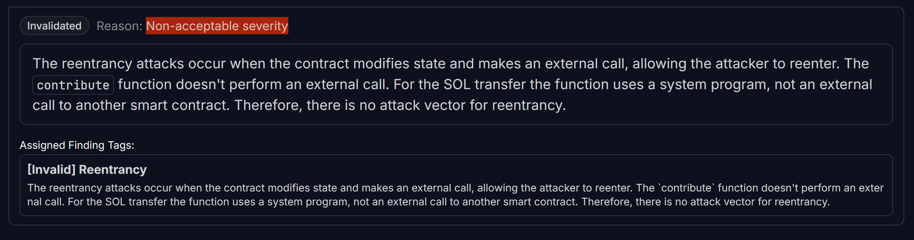

## <a id='H-07'></a>H-07. Potential Reentrancy Attack Due to State Updates After Transfer            


## Summary

The `contribute` function updates the fund state after transferring funds, which opens the possibility for a reentrancy attack if Solana adds custom programs that allow indirect reentrancy.

## Vulnerability Details

* The function first executes the SOL transfer:

```Rust
system_program::transfer(cpi_context, amount)?;
```

* Then, it updates the total raised amount:

```Rust
fund.amount_raised += amount;
```

* If a malicious program is attached to the recipient account, it could execute another function call before fund.amount\_raised is updated, leading to inconsistencies.

## Impact

* **Fund total raised could be manipulated** before finalizing contributions.
* &#x20;

  **If Solana allows future program hooks, this can be exploited.**
* **Defensive coding practice suggests always updating state before external calls.**

## Tools Used

Manual Code Review

## Recommendations

Final Comprehensive Secured Version of `contribute`Function:

```Rust
pub fn contribute(ctx: Context<FundContribute>, amount: u64) -> Result<()> {
    let fund = &mut ctx.accounts.fund;
    let contribution = &mut ctx.accounts.contribution;

    // ✅ [Fix] Check that the contribution amount is greater than zero to prevent no-op transactions
    if amount == 0 {
        return Err(ErrorCode::UnauthorizedAccess.into()); // More descriptive error could be used
    }

    // ✅ [Fix] Safely get the current blockchain timestamp and handle conversion errors
    let current_time = Clock::get()
        .map_err(|_| ErrorCode::CalculationOverflow)?
        .unix_timestamp
        .try_into()
        .map_err(|_| ErrorCode::CalculationOverflow)?;

    // ✅ [Fix] Enforce deadline properly, ensuring past contributions are not allowed
    if fund.deadline != 0 && fund.deadline < current_time {
        return Err(ErrorCode::DeadlineReached.into());
    }

    // ✅ [Fix] Initialize the contribution account properly, if it's a new contribution
    if contribution.contributor == Pubkey::default() {
        contribution.contributor = ctx.accounts.contributor.key();
        contribution.fund = fund.key();
        contribution.amount = 0; // Initialize contribution amount
    }


    // ✅ [Fix] Prevent integer overflow when adding contribution amounts
    contribution.amount = contribution
        .amount
        .checked_add(amount)
        .ok_or(ErrorCode::CalculationOverflow)?;

    // ✅ [Fix] Prevent integer overflow when updating fund's total raised amount
    fund.amount_raised = fund
        .amount_raised
        .checked_add(amount)
        .ok_or(ErrorCode::CalculationOverflow)?;

    // ✅ [Fix] Ensure the state is updated **before** performing the transfer to avoid reentrancy risks

    // Transfer SOL from contributor to fund account
    let cpi_context = CpiContext::new(
        ctx.accounts.system_program.to_account_info(),
        system_program::Transfer {
            from: ctx.accounts.contributor.to_account_info(),
            to: fund.to_account_info(),
        },
    );
     
    // Perform the transfer
    system_program::transfer(cpi_context, amount)?; 

    Ok(())
}

```

## Judge Decision 
<span style="color:red; font-weight:bold;">(Invalidated. Reason: Non-acceptable severity)</span>



## Appeal Submitted

### Incorrect Order of Operations in `contribute()` Violates Checks-Effects-Interactions Pattern

* **Original Severity:** High
* Revised Severity: Low

&#x20;

**Summary**

&#x20;

The `contribute()` function violates the widely accepted **Checks-Effects-Interactions (CEI)** pattern by performing an external SOL transfer **before** updating internal state. While the transfer uses Solana’s `system_program::transfer` — which does not currently support reentrant execution — CEI remains a critical **defensive programming pattern** that helps prevent state inconsistencies and hard-to-debug edge cases.

**The function Flow:**

The external fund transfer occurs in step 3, **before** updating the program’s internal accounting in step 4.

This ordering goes against CEI: **state updates ("effects") should occur before any interaction with external accounts or programs** to ensure safety in all execution scenarios.

```TypeScript
// 1. Validate deadline
if fund.deadline != 0 && fund.deadline < now {
    return Err(...);
}

// 2. Initialize contribution account if needed
if contribution.contributor == Pubkey::default() {
    contribution.contributor = ...;
    contribution.amount = 0;
}

// 3. ⚠️ Transfer funds
system_program::transfer(cpi_context, amount)?;

// 4. ✅ Update internal state
fund.amount_raised += amount;
````

**Impact:**

State inconsistency if the transaction fails after transfer but before state update.

#### Conclusion

&#x20;

While there is no active exploit path in this case, this pattern is a best practice in all ecosystems including Solana.&#x20;

This should be considered a **low-severity issue**, not a critical one.

## Judge Decision on Appeal: 
<span style="color:red; font-weight:bold;">(Invalidated. Reason: Non-acceptable severity)</span>


I agree that the CEI pattern is not followed. But in this case, there is no security risk on the protocol, therefore this is Informational finding (invalid).

The reentrancy attacks occur when the contract modifies state and makes an external call, allowing the attacker to reenter. The `contribute` function does not perform an external call. For the SOL transfer the function uses a system program, not an external call to another smart contract. Therefore, there is no attack vector for reentrancy.
